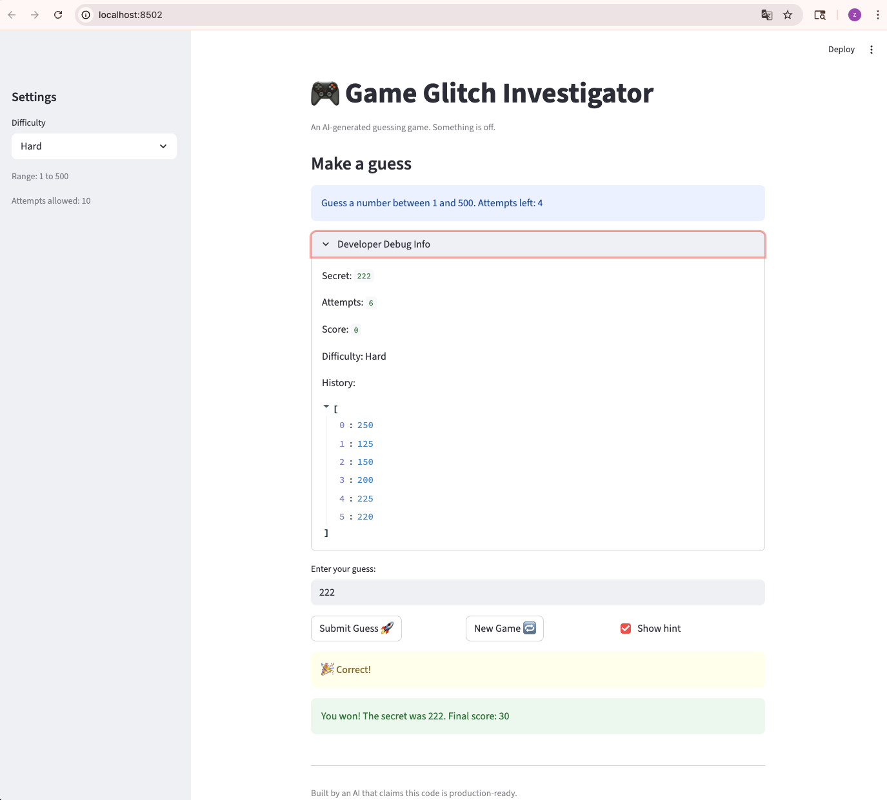

# 🎮 Game Glitch Investigator: The Impossible Guesser

## 🚨 The Situation

You asked an AI to build a simple "Number Guessing Game" using Streamlit.
It wrote the code, ran away, and now the game is unplayable. 

- You can't win.
- The hints lie to you.
- The secret number seems to have commitment issues.

## 🛠️ Setup

1. Install dependencies: `pip install -r requirements.txt`
2. Run the broken app: `python -m streamlit run app.py`

## 🕵️‍♂️ Your Mission

1. **Play the game.** Open the "Developer Debug Info" tab in the app to see the secret number. Try to win.
2. **Find the State Bug.** Why does the secret number change every time you click "Submit"? Ask ChatGPT: *"How do I keep a variable from resetting in Streamlit when I click a button?"*
3. **Fix the Logic.** The hints ("Higher/Lower") are wrong. Fix them.
4. **Refactor & Test.** - Move the logic into `logic_utils.py`.
   - Run `pytest` in your terminal.
   - Keep fixing until all tests pass!

## 📝 Document Your Experience

- [ ] Describe the game's purpose.
- [ ] Detail which bugs you found.
- [ ] Explain what fixes you applied.

This game had six bugs in total:

1. **Reversed hints** — `check_guess` returned "Go HIGHER!" when the guess was too high, and "Go LOWER!" when too low. Fixed by swapping the messages.
2. **Negative final score** — `update_score` deducted 5 points per wrong guess, while the win bonus also shrank with more attempts. Double penalty meant the score was almost always negative at the end. Fixed by removing the per-guess deduction — attempt count already penalizes the player through a lower win bonus.
3. **String comparison bug** — On even-numbered attempts, the secret was cast to a string before comparison, causing unreliable results. Fixed by always comparing integers directly.
4. **Difficulty change didn't reset the game** — Switching difficulty in the sidebar changed the displayed range but kept the old secret number, letting players exploit the mismatch. Fixed by storing difficulty in `st.session_state` and resetting the game whenever it changes.
5. **Hard mode was nearly impossible** — Hard had only 5 attempts for a range of 1–500, but binary search requires at least 9 attempts to guarantee a win. Fixed by raising Hard's attempt limit to 10.
6. **No range validation on guesses** — `parse_guess` accepted any integer, including numbers outside the valid range. Fixed by checking the parsed value against `low` and `high` in `app.py`. Invalid guesses also no longer get appended to the history.

All game logic is in `logic_utils.py`. Nine pytest cases verify the fixes, all passing.

## 📸 Demo

- [ ] [Insert a screenshot of your fixed, winning game here]

## 🚀 Stretch Features

- [ ] [If you choose to complete Challenge 4, insert a screenshot of your Enhanced Game UI here]
